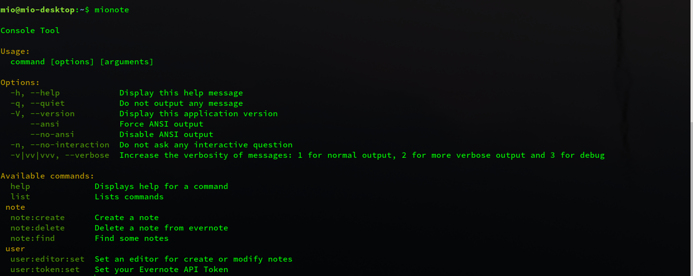
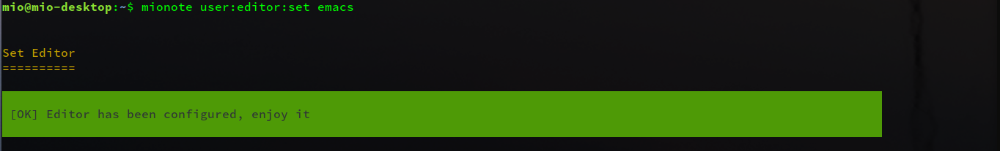

# Mionote
A PHP implementation of Evernote, for personal, for terminal user

## Features
1. Create note
2. Find note
3. Delete note

## Screenshots
1. mionote


2. Set editor


2. 
## Get Your Evernote TOKEN
Visit [Evernote](https://www.evernote.com/api/DeveloperToken.action) to get your TOKEN, if you accidentally missed this page, this is the url:  
```shell
https://www.evernote.com/api/DeveloperToken.action
```

## Install

Mionote requires some libraries, these libraries can be installed via [composer](https://getcomposer.org).
Just run these commands to install composer:  
```shell
curl -sS https://getcomposer.org/installer | php
mv composer.phar /usr/bin/composer
chmod +x /usr/bin/composer
```

Now you can install requirements via composer in project directory  
```shell
composer install
```
You can set mionote as a system command:  
```shell
ln -s mionote /usr/local/bin/mionote
```


## Events
> You can write some hook for create,find,delete note

Coming soom

## Usage
Before you to explore this app, you need set you TOKEN and editor via two commands:  
```shell
mionote user:token:set     # Set your evernote TOKEN
mionote user:editor:set    # Set your editor for create
```


## Uninstall
